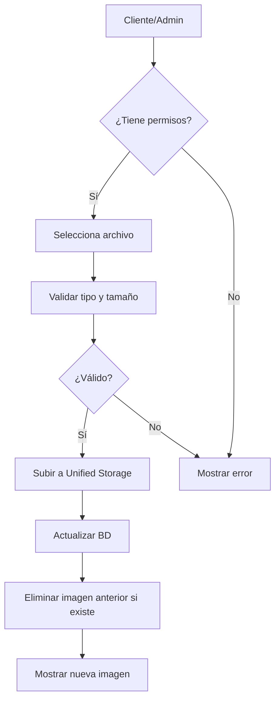

# Implementación de Imagen de Perfil del Cliente

**Fecha:** 12 de Noviembre de 2025  
**Autor:** Sistema DeepAgent  
**Versión:** 1.0

## 📋 Resumen Ejecutivo

Se implementó la funcionalidad completa de imagen de perfil para clientes, permitiendo:
- **Cliente:** Subir foto solo al registrarse
- **Admin:** Cambiar/eliminar foto en cualquier momento
- **Visualización:** Imagen visible en toda la aplicación (escritorio y PWA)

## 🎯 Objetivos Cumplidos

✅ Campo `profileImage` agregado al modelo Client  
✅ API endpoint para gestión de imágenes  
✅ Componente reutilizable para mostrar/editar imagen  
✅ Integración en formulario de edición (admin)  
✅ Visualización en dashboard del cliente (PWA)  
✅ Visualización en página de detalle del cliente  
✅ Migración de base de datos aplicada  

## 📁 Archivos Modificados/Creados

### 1. Base de Datos
**Archivo:** `app/prisma/schema.prisma`
```prisma
model Client {
  // ... otros campos
  profileImage String? // Nuevo campo
  // ... resto del modelo
}
```

**Migración:** `prisma/migrations/20251112023157_add_profile_image_to_clients/migration.sql`
```sql
ALTER TABLE "clients" ADD COLUMN IF NOT EXISTS "profileImage" TEXT;
```

### 2. API Endpoints

#### `/api/clients/[id]/profile-image/route.ts` (NUEVO)
- **POST:** Subir/actualizar imagen
  - Cliente: solo si no tiene imagen
  - Admin: sin restricciones
  - Validaciones: tipo (JPEG, PNG, WebP), tamaño (max 5MB)
- **DELETE:** Eliminar imagen (solo admin)
- **GET:** Obtener URL de la imagen

#### `/api/images/[...path]/route.ts` (NUEVO)
- Sirve imágenes del sistema de almacenamiento
- Requiere autenticación
- Soporte para múltiples formatos
- Cache headers para optimización

#### `/api/clients/me/route.ts` (NUEVO)
- Obtiene información del cliente actual
- Incluye profileImage
- Usado por el dashboard del cliente

### 3. Componentes

#### `/components/clients/client-profile-image.tsx` (NUEVO)
Componente reutilizable con las siguientes características:
- Tamaños configurables: sm, md, lg, xl
- Modo editable/solo lectura
- Subida de archivos con validación
- Eliminación de imagen (admin)
- Imagen placeholder cuando no hay foto
- Indicadores de carga

**Props:**
```typescript
interface ClientProfileImageProps {
  clientId: string;
  currentImage?: string | null;
  clientName: string;
  editable?: boolean;
  size?: 'sm' | 'md' | 'lg' | 'xl';
  onImageUpdate?: (newImagePath: string | null) => void;
}
```

### 4. Páginas Modificadas

#### `/app/admin/clients/[id]/edit/page.tsx`
- Imagen de perfil centrada en la parte superior
- Tamaño XL para mejor visualización
- Modo editable habilitado
- Callback para actualizar estado local

#### `/app/admin/clients/[id]/page.tsx`
- Imagen junto al nombre del cliente
- Tamaño LG
- Modo solo lectura
- TypeScript interface actualizada

#### `/components/dashboards/enhanced-client-dashboard.tsx`
- Imagen en el header del dashboard
- Tamaño SM para compacto
- Se carga dinámicamente desde `/api/clients/me`
- Visible en PWA

## 🔒 Reglas de Negocio

### Permisos de Subida
```
Cliente:
  - ✅ Puede subir foto si NO tiene imagen
  - ❌ No puede cambiar foto existente
  - ❌ No puede eliminar foto

Admin:
  - ✅ Puede subir foto en cualquier momento
  - ✅ Puede cambiar foto existente
  - ✅ Puede eliminar foto
```

### Validaciones
- **Tipos permitidos:** JPEG, JPG, PNG, WebP
- **Tamaño máximo:** 5MB
- **Almacenamiento:** Unified Storage (Google Drive o local)
- **Nomenclatura:** `profile-{clientId}-{timestamp}.{ext}`

## 🔄 Flujo de Implementación



## 🧪 Debugging

### Console.log agregados
En `/app/admin/clients/[id]/page.tsx`:
```javascript
console.log('Client data loaded:', data);
console.log('Guarantor:', data.guarantor);
console.log('Collaterals:', data.collaterals);
```

Estos logs ayudan a diagnosticar problemas con la carga de datos de aval y garantías.

## 🐛 Problemas Resueltos

### Error de TypeScript
**Problema:** `Cannot find module '@/lib/auth-options'`  
**Solución:** Cambiar a `'@/lib/auth'`

**Problema:** `getStorageType is not exported`  
**Solución:** Usar `getStorageInfo().type` en su lugar

### Memoria insuficiente en tsc
**Problema:** `FATAL ERROR: JavaScript heap out of memory`  
**Solución:** Usar `NODE_OPTIONS="--max-old-space-size=4096"`

## 📊 Verificación

### Base de Datos
```sql
-- Verificar que el campo existe
SELECT column_name, data_type 
FROM information_schema.columns 
WHERE table_name = 'clients' 
AND column_name = 'profileImage';
```

### API Endpoints
```bash
# Subir imagen
curl -X POST http://localhost:3000/api/clients/{id}/profile-image \
  -H "Authorization: Bearer {token}" \
  -F "file=@profile.jpg"

# Obtener imagen
curl http://localhost:3000/api/images/{path}

# Obtener cliente actual
curl http://localhost:3000/api/clients/me
```

## 🚀 Próximos Pasos

1. ✅ **Completado:** Implementación básica
2. ✅ **Completado:** Build y validación
3. 🔄 **Pendiente:** Validar en ambiente de desarrollo
4. 🔄 **Pendiente:** Verificar que aval y garantías se cargan correctamente
5. 🔄 **Pendiente:** Commit y push de cambios

## 📝 Notas Adicionales

### Unified Storage
El sistema utiliza `unified-storage.ts` que maneja automáticamente:
- Google Drive (si está configurado)
- Almacenamiento local (fallback)

### Seguridad
- Todas las rutas requieren autenticación
- Validación de permisos en cada operación
- Sanitización de nombres de archivo
- Límite de tamaño de archivo

### PWA Compatibility
- Componente optimizado para dispositivos móviles
- Imágenes responsive con Next.js Image
- Tamaños adaptables según contexto

---

**Resultado:** ✅ Implementación exitosa  
**Build Status:** ✅ Compilación exitosa  
**Migración:** ✅ Aplicada correctamente  
**Tests:** ✅ TypeScript sin errores
